# 🌀 AOP (Aspect Oriented Programming): The "Magic" Behind @Transactional

You are now digging into the **core magic** of Spring! 🪄

While **Filters** and **Interceptors** handle **HTTP Requests**, **AOP** handles **Java Method Calls**. It allows you to separate "cross-cutting concerns" (like logging, transactions, security) from your business logic.

---

## 🤖 The Analogy: The "Personal Assistant"

| Component | Analogy | Explanation |
|-----------|---------|-------------|
| **Target Object** | **The CEO** | Does the actual work (Business Logic). |
| **Proxy** | **The Personal Assistant** | Stands between you and the CEO. You talk to the Assistant, not the CEO directly. |
| **Aspect** | **The Assistant's Instructions** | "Before meeting, record audio. After meeting, send summary." |
| **Advice** | **The Action** | Recording audio, sending summary. |
| **Pointcut** | **The Schedule** | "Apply these instructions only to meetings labeled 'Confidential'." |

**In Spring:** When you `@Autowired` a Service, you rarely get the **real** object. You get the **Proxy** (Assistant).

---

## 🔄 How AOP Works: The Proxy Pattern

Here is the **under-the-hood flow** when you call a method annotated with `@Transactional`:

```mermaid
sequenceDiagram
    participant Client as 🖥️ Controller
    participant Proxy as 🎭 Spring Proxy (AOP)
    participant Aspect as 📜 Transaction Aspect
    participant Target as 🎯 Real UserService
    participant DB as 🗄️ Database

    Client->>Proxy: 1. createUser(data)
    Note over Proxy: Client thinks this<br/>is the real Service
    
    Proxy->>Aspect: 2. Before Advice
    Aspect->>DB: 3. BEGIN TRANSACTION
    
    Proxy->>Target: 4. Invoke Real Method
    Note over Target: Business Logic<br/>save(user)
    
    Target-->>Proxy: 5. Return Result
    
    alt Success
        Proxy->>Aspect: 6. After Returning
        Aspect->>DB: 7. COMMIT TRANSACTION
    else Exception
        Proxy->>Aspect: 8. After Throwing
        Aspect->>DB: 9. ROLLBACK TRANSACTION
    end
    
    Proxy-->>Client: 10. Return Response
```



---

## 📚 Key AOP Terminology

| Term | Definition | Spring Annotation |
|------|------------|-------------------|
| **Aspect** | A module that encapsulates cross-cutting concerns. | `@Aspect` |
| **Advice** | **Action** taken by an aspect (Before, After, Around). | `@Before`, `@After`, `@Around` |
| **Pointcut** | **Expression** that defines *where* advice should apply. | `@Pointcut`, `execution(...)` |
| **Joinpoint** | A specific point in execution (e.g., method execution). | (Implicit in Spring) |
| **Target** | The actual object being advised (your Service). | `@Service` |
| **Weaving** | The process of linking aspects with other types. | (Done at runtime by Spring) |
| **Proxy** | The object created after weaving (what you inject). | (Hidden) |

---

## 💻 Code Example: Custom Logging Aspect

Let's create an aspect that logs execution time for all Service methods.

### 1. **Define the Aspect**
```java
@Aspect
@Component
public class LoggingAspect {

    // Define a Pointcut: Match all methods in @Service classes
    @Pointcut("within(@org.springframework.stereotype.Service *)")
    public void serviceLayer() {}

    // Around Advice: Wrap the method execution
    @Around("serviceLayer()")
    public void logExecutionTime(ProceedingJoinPoint joinPoint) throws Throwable {
        long start = System.currentTimeMillis();
        
        // 🎯 This executes the actual method
        Object result = joinPoint.proceed(); 
        
        long end = System.currentTimeMillis();
        
        System.out.println("⏱️ " + joinPoint.getSignature().getName() 
                           + " took " + (end - start) + "ms");
        
        // Return result to caller
        // (If method returns void, result is null)
    }
}
```

### 2. **The Target Service (No Logging Code!)**
```java
@Service
public class UserService {
    
    @Autowired
    private UserRepository repo;

    // ✅ Clean business logic. No logging code here.
    public User createUser(UserDTO dto) {
        // Simulate work
        try { Thread.sleep(100); } catch (Exception e) {}
        return repo.save(new User(dto.getName()));
    }
}
```

**Result:** When `createUser` is called, the **Proxy** runs `LoggingAspect` automatically.

---

## 🪄 How `@Transactional` Works (AOP in Action)

You've used `@Transactional` many times. Here is what Spring does behind the scenes:

```java
// 🟢 What you write
@Service
public class UserService {
    @Transactional
    public void transferMoney() {
        accountA.withdraw(100);
        accountB.deposit(100);
        // If this throws exception → ROLLBACK
    }
}
```

```java
// 🔵 What Spring Proxy actually executes (Simplified)
public class UserServiceProxy {
    private UserService target;
    private TransactionManager txManager;

    public void transferMoney() {
        // 1. Before Advice
        TransactionStatus status = txManager.getTransaction();
        
        try {
            // 2. Invoke Target
            target.transferMoney();
            
            // 3. After Returning Advice
            txManager.commit(status);
        } catch (Exception e) {
            // 4. After Throwing Advice
            txManager.rollback(status);
            throw e;
        }
    }
}
```

---

## ⚠️ The Biggest Pitfall: Self-Invocation

This is the **#1 interview question** and debugging nightmare with AOP.

### ❌ The Problem
```java
@Service
public class UserService {
    
    public void externalMethod() {
        // ❌ This calls 'this.internalMethod()'
        // It bypasses the Proxy! Transaction will NOT start.
        this.internalMethod(); 
    }

    @Transactional
    public void internalMethod() {
        // Database operations
    }
}
```

### ✅ The Solution
```java
@Service
public class UserService {
    
    @Autowired
    @Lazy // Prevent circular dependency
    private UserService selfProxy;

    public void externalMethod() {
        // ✅ Calls through the Proxy
        selfProxy.internalMethod(); 
    }

    @Transactional
    public void internalMethod() {
        // Database operations
    }
}
```
**Why?** AOP works via **Proxies**. When you call `this.method()`, you are inside the real object, bypassing the Proxy wrapper.

---

## 🆚 Filters vs. Interceptors vs. AOP

| Feature | **Filter** 🛡️ | **Interceptor** 🎯 | **AOP** 🌀 |
|---------|---------------|-------------------|------------|
| **Scope** | HTTP Request | HTTP Request | **Java Method Call** |
| **Layer** | Servlet Container | Spring MVC | **Spring ApplicationContext** |
| **Target** | URLs (`/api/*`) | Controller Handlers | **Any Bean Method** |
| **Access** | Request/Response | Request/Response/Handler | **Method Args, Return Value, Exception** |
| **Use Case** | CORS, Compression | AuthZ, Logging | **Transactions, Caching, Async, Logging** |
| **Performance** | Fastest | Medium | **Slight Overhead (Proxy)** |

---

## 🧠 Visual Summary: Where Does It Fit?

```mermaid
graph TB
    subgraph "HTTP Layer"
        Filter[🛡️ Filter<br/>Servlet Spec]
        Interceptor[🎯 Interceptor<br/>Spring MVC]
    end
    
    subgraph "Spring Bean Layer"
        Proxy[🎭 AOP Proxy<br/>JDK/CGLIB]
        Target[🎯 Target Bean<br/>@Service]
    end
    
    Client[🖥️ Client] --> Filter
    Filter --> Interceptor
    Interceptor --> Proxy
    Proxy --> Target
    
    style Proxy fill:#9B59B6,stroke:#8E44AD,color:#fff,stroke-width:3px
    style Target fill:#2ECC71,stroke:#27AE60,color:#fff
```



---

## 🎓 Summary Checklist

| Concept | Key Takeaway |
|---------|--------------|
| **AOP** | Separates cross-cutting concerns (logging, tx) from business logic. |
| **Proxy** | Spring injects a wrapper object, not the real object. |
| **Advice** | The code that runs (Before, After, Around). |
| **Pointcut** | The rule that decides which methods get advised. |
| **@Transactional** | Implemented via AOP (Around Advice). |
| **Self-Invocation** | Calling `this.method()` bypasses AOP. Use proxy injection or refactor. |

---

## 🚀 What's Next?

You now understand the **Spring Request & Method Lifecycle**:
1.  **Filter** (Servlet)
2.  **Interceptor** (MVC)
3.  **DispatcherServlet** (Routing)
4.  **AOP Proxy** (Method Interception)
5.  **Controller/Service** (Business Logic)

Where do you want to go deeper?

1.  **🔐 Spring Security Filter Chain:** How Spring Security uses a *chain of filters* (not AOP) for authentication.
2.  **🌱 Spring Bean Lifecycle:** `@PostConstruct`, `InitializingBean`, BeanPostProcessor.
3.  **🐞 Debugging Workshop:** How to see the **Proxy class** in your debugger (you'll be surprised!).
4.  **📈 Advanced AOP:** Aspect ordering, custom annotations, and load-time weaving.

Let me know! 😊
