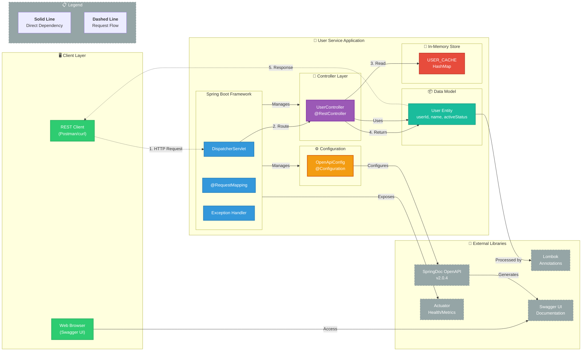

```mermaid
graph LR
    %% ==================== CLIENT LAYER ====================
    subgraph Clients["🖥️ Client Layer"]
        direction TB
        REST["REST Client<br/>(Postman/curl)"]
        BROWSER["Web Browser<br/>(Swagger UI)"]
    end
    
    %% ==================== APPLICATION LAYER ====================
    subgraph App["🚀 User Service Application"]
        direction TB
        
        subgraph Spring["Spring Boot Framework"]
            DS["DispatcherServlet"]
            RM["@RequestMapping"]
            EH["Exception Handler"]
        end
        
        subgraph Controller["📡 Controller Layer"]
            UC["UserController<br/>@RestController"]
        end
        
        subgraph Config["⚙️ Configuration"]
            OAC["OpenApiConfig<br/>@Configuration"]
        end
        
        subgraph Model["📦 Data Model"]
            User["User Entity<br/>userId, name, activeStatus"]
        end
        
        subgraph Storage["💾 In-Memory Store"]
            Cache["USER_CACHE<br/>HashMap<String, User>"]
        end
    end
    
    %% ==================== EXTERNAL SERVICES ====================
    subgraph External["🔌 External Libraries"]
        OAI["SpringDoc OpenAPI<br/>v2.0.4"]
        ACT["Actuator<br/>Health/Metrics"]
        LOMBOK["Lombok<br/>Annotations"]
        SWAGGER["Swagger UI<br/>Documentation"]
    end
    
    %% ==================== REQUEST FLOW (Highlighted) ====================
    REST -.->|1. HTTP Request| DS
    DS -->|2. Route| UC
    UC -->|3. Read| Cache
    UC -->|4. Return| User
    User -.->|5. Response| REST
    
    BROWSER -->|Access| SWAGGER
    
    %% ==================== INTERNAL CONNECTIONS ====================
    UC -->|Uses| User
    OAC -->|Configures| OAI
    OAI -->|Generates| SWAGGER
    User -->|Processed by| LOMBOK
    
    Spring -->|Manages| Controller
    Spring -->|Manages| Config
    Spring -->|Exposes| ACT
    
    %% ==================== STYLING ====================
    classDef client fill:#2ECC71,stroke:#27AE60,color:#fff,stroke-width:2px
    classDef spring fill:#3498DB,stroke:#2980B9,color:#fff,stroke-width:2px
    classDef controller fill:#9B59B6,stroke:#8E44AD,color:#fff,stroke-width:3px
    classDef config fill:#F39C12,stroke:#D35400,color:#fff,stroke-width:2px
    classDef model fill:#1ABC9C,stroke:#16A085,color:#fff,stroke-width:2px
    classDef storage fill:#E74C3C,stroke:#C0392B,color:#fff,stroke-width:2px
    classDef external fill:#95A5A6,stroke:#7F8C8D,color:#fff,stroke-width:1px,stroke-dasharray: 5 5
    
    class REST,BROWSER client
    class DS,RM,EH spring
    class UC controller
    class OAC config
    class User model
    class Cache storage
    class OAI,ACT,LOMBOK,SWAGGER external
    
    %% ==================== LEGEND ====================
    subgraph Legend["📋 Legend"]
        direction TB
        L1["<b>Solid Line</b><br/>Direct Dependency"]
        L2["<b>Dashed Line</b><br/>Request Flow"]
    end
    
    class Legend external
```
