# 🛡️ Filters vs. Interceptors: The Gatekeepers of Spring

This is the **perfect next step** after understanding `DispatcherServlet`. Many developers mix them up, but knowing the difference is crucial for **security, logging, and performance**.

---

## 🏨 The Hotel Analogy

| Component | Analogy | What it does |
|-----------|---------|--------------|
| **Filter** | **Security Guard at Building Entrance** | Checks ID before you even enter the lobby. Doesn't care which room you're going to. |
| **DispatcherServlet** | **Receptionist** | Directs you to the correct floor/room based on your request. |
| **Interceptor** | **Floor Concierge** | Checks your key card before letting you into the elevator. Knows which room you're trying to access. |
| **Controller** | **Hotel Room** | Where the actual business happens (sleep, work, relax). |

---

## 🔄 Request Lifecycle: Where They Fit

Here is the **exact order** of execution in a Spring Boot application:

```mermaid
sequenceDiagram
    participant Client as 🖥️ Client
    participant Filter as 🛡️ Filter (Servlet)
    participant DS as 🚦 DispatcherServlet
    participant Interceptor as 🎯 Interceptor (Spring)
    participant Controller as 📡 Controller

    Client->>Filter: 1. HTTP Request
    Note over Filter: Can block here<br/>(e.g., CORS, Auth)
    
    Filter->>DS: 2. Pass to Spring
    DS->>Interceptor: 3. preHandle()
    Note over Interceptor: Before Controller<br/>(e.g., Check Role)
    
    Interceptor->>Controller: 4. Invoke Controller
    Note over Controller: Business Logic
    
    Controller-->>Interceptor: 5. Return Result
    Interceptor-->>Interceptor: 6. postHandle()
    Note over Interceptor: After Controller<br/>(Modify Model)
    
    Interceptor-->>DS: 7. Continue
    DS-->>Filter: 8. Response Ready
    Filter-->>Filter: 9. onCompletion()
    Note over Filter: Final Cleanup<br/>(Logging, Compression)
    
    Filter-->>Client: 10. HTTP Response
```



---

## ⚔️ Key Differences Table

| Feature | **Filter** 🛡️ | **Interceptor** 🎯 |
|---------|---------------|-------------------|
| **Origin** | Java Servlet Specification (`javax.servlet` / `jakarta.servlet`) | Spring MVC Framework (`org.springframework.web`) |
| **Execution Order** | **First** (Before DispatcherServlet) | **Second** (Inside DispatcherServlet) |
| **Access** | Only `ServletRequest` & `ServletResponse` | `HttpServletRequest`, `Response`, **& Handler (Controller)** |
| **Container** | Runs in Servlet Container (Tomcat/Jetty) | Runs in Spring ApplicationContext |
| **Dependency Injection** | ❌ No (unless wrapped) | ✅ Yes (`@Autowired` works) |
| **Use Cases** | CORS, Compression, Security Auth, Raw Logging | Authorization, Handler-specific Logging, Model Manipulation |
| **Configuration** | `@Component` or `FilterRegistrationBean` | `WebMvcConfigurer` + `@Component` |

---

## 💻 Code Examples (Spring Boot 3+)

### 1. **Filter Example** (Global Security Check)
*Runs before Spring even knows about the request.*

```java
@Component
public class RequestLoggingFilter implements Filter {

    @Override
    public void doFilter(ServletRequest request, ServletResponse response, 
                         FilterChain chain) throws IOException, ServletException {
        
        long startTime = System.currentTimeMillis();
        HttpServletRequest httpRequest = (HttpServletRequest) request;
        
        System.out.println("🛡️ Filter: Request URI - " + httpRequest.getRequestURI());
        
        // Pass request down the chain
        chain.doFilter(request, response);
        
        long endTime = System.currentTimeMillis();
        System.out.println("🛡️ Filter: Took " + (endTime - startTime) + " ms");
    }
}
```

### 2. **Interceptor Example** (Handler-Specific Logic)
*Runs within Spring, knows which Controller method is being called.*

```java
@Component
public class AuthInterceptor implements HandlerInterceptor {

    @Autowired
    private UserService userService; // ✅ Can inject Spring Beans!

    @Override
    public boolean preHandle(HttpServletRequest request, HttpServletResponse response, 
                             Object handler) throws Exception {
        
        System.out.println("🎯 Interceptor: preHandle - Before Controller");
        
        // Example: Check if user is active
        String userId = request.getHeader("X-User-ID");
        if (userId != null && !userService.isActive(userId)) {
            response.sendError(403, "User not active");
            return false; // ⛔ Stop request here
        }
        
        return true; // ✅ Continue to Controller
    }

    @Override
    public void postHandle(HttpServletRequest request, HttpServletResponse response, 
                           Object handler, ModelAndView modelAndView) throws Exception {
        System.out.println("🎯 Interceptor: postHandle - After Controller, Before Response");
        // Can modify ModelAndView here
    }

    @Override
    public void afterCompletion(HttpServletRequest request, HttpServletResponse response, 
                                Object handler, Exception ex) throws Exception {
        System.out.println("🎯 Interceptor: afterCompletion - Request Fully Finished");
        // Resource cleanup
    }
}
```

### 3. **Registering the Interceptor**
*Filters auto-register with `@Component`. Interceptors need configuration.*

```java
@Configuration
public class WebConfig implements WebMvcConfigurer {

    @Autowired
    private AuthInterceptor authInterceptor;

    @Override
    public void addInterceptors(InterceptorRegistry registry) {
        registry.addInterceptor(authInterceptor)
                .addPathPatterns("/api/**")       // Apply to these URLs
                .excludePathPatterns("/api/public"); // Except these
    }
}
```

---

## 🧠 Decision Matrix: Which One Should I Use?

```mermaid
graph TD
    Start[Need to intercept request?] --> Q1{Need access to<br/>Spring Beans?}
    Q1 -->|Yes| Interceptor[Use **Interceptor**]
    Q1 -->|No| Q2{Need to block before<br/>Spring loads?}
    
    Q2 -->|Yes| Filter[Use **Filter**]
    Q2 -->|No| Q3{Need to modify<br/>HTTP Headers broadly?}
    
    Q3 -->|Yes| Filter[Use **Filter**<br/>(e.g., CORS, Compression)]
    Q3 -->|No| Q4{Need to know which<br/>Controller method?}
    
    Q4 -->|Yes| Interceptor[Use **Interceptor**]
    Q4 -->|No| Filter[Use **Filter**<br/>(Simpler, lighter)]

    style Interceptor fill:#9B59B6,stroke:#8E44AD,color:#fff
    style Filter fill:#3498DB,stroke:#2980B9,color:#fff
```

---

## 🚨 Common Pitfalls

| Pitfall | Solution |
|---------|----------|
| **Ordering Issues** | Filters run before Interceptors. Don't put Spring logic in Filters. |
| **Exception Handling** | Exceptions in Interceptors can be caught by `@ControllerAdvice`. Exceptions in Filters **cannot**. |
| **Dependency Injection** | Filters don't support `@Autowired` by default. Use `FilterRegistrationBean` if needed. |
| **Performance** | Too many Filters/Interceptors slow down every request. Keep them lightweight. |

---

## 🎓 Summary Checklist

| Concept | Key Takeaway |
|---------|--------------|
| **DispatcherServlet** | The central hub that routes requests to controllers. |
| **Filter** | Servlet-level. Runs **before** Spring. Good for CORS, Compression, Raw Security. |
| **Interceptor** | Spring-level. Runs **inside** Spring. Good for AuthZ, Logging, Handler logic. |
| **Order** | Filter → DispatcherServlet → Interceptor → Controller → Interceptor → DispatcherServlet → Filter |

---

## 🚀 What's Next?

Now that you understand the request flow, where do you want to go deeper?

1.  **🔐 Spring Security Filter Chain:** How Spring Security uses *many* filters to handle login/auth.
2.  **🐞 Debugging Workshop:** How to set breakpoints in `DispatcherServlet` to watch this flow live.
3.  **📈 AOP (Aspect Oriented Programming):** Another way to intercept logic (like `@Transactional`) without Filters/Interceptors.
4.  **🌍 Global Exception Handling:** How `@ControllerAdvice` fits into this flow.

Which one interests you? 😊
