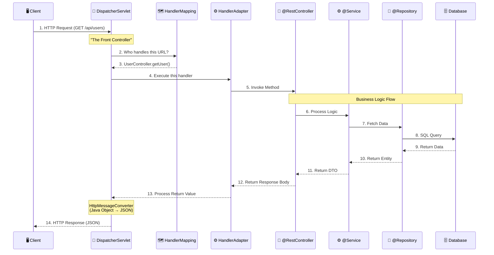

```mermaid
sequenceDiagram
    participant Client as 🖥️ Client
    participant DS as 🚦 DispatcherServlet
    participant HM as 🗺️ HandlerMapping
    participant HA as ⚙️ HandlerAdapter
    participant Controller as 📡 @RestController
    participant Service as ⚙️ @Service
    participant Repo as 💾 @Repository
    participant DB as 🗄️ Database

    Client->>DS: 1. HTTP Request (GET /api/users)
    Note over DS: "The Front Controller"
    
    DS->>HM: 2. Who handles this URL?
    HM-->>DS: 3. UserController.getUser()
    
    DS->>HA: 4. Execute this handler
    HA->>Controller: 5. Invoke Method
    
    Note over Controller, DB: Business Logic Flow
    Controller->>Service: 6. Process Logic
    Service->>Repo: 7. Fetch Data
    Repo->>DB: 8. SQL Query
    DB-->>Repo: 9. Return Data
    Repo-->>Service: 10. Return Entity
    Service-->>Controller: 11. Return DTO
    
    Controller-->>HA: 12. Return Response Body
    HA-->>DS: 13. Process Return Value
    Note over DS: HttpMessageConverter<br/>(Java Object → JSON)
    
    DS-->>Client: 14. HTTP Response (JSON)
```
